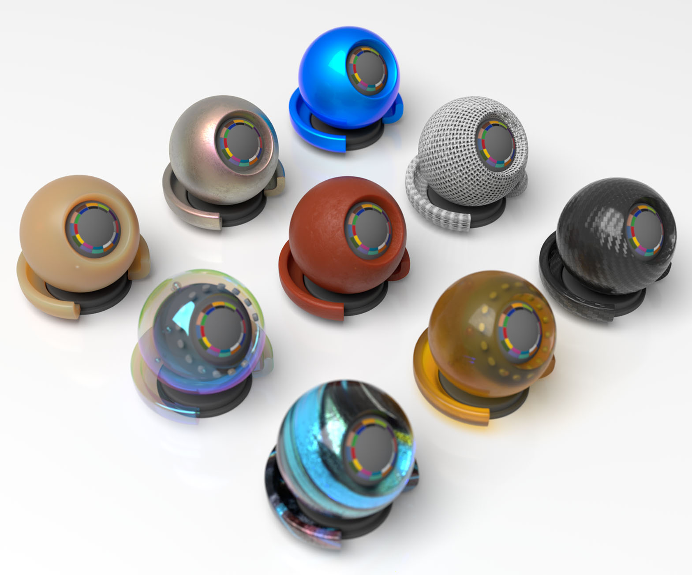

# OpenPBR Surface

    

A white paper specifying an über-surface shader that aims to provide a material representation capable of accurately modeling the vast majority of materials used in practical visual effects and feature animation productions.

OpenPBR is an open standard hosted by the Academy Software Foundation (ASWF), and is organized as a subproject of MaterialX.

### Resources

* **[White paper](https://academysoftwarefoundation.github.io/OpenPBR/)** – typeset in [Markdeep](https://casual-effects.com/markdeep/)
* **[Reference implementation](reference/open_pbr_surface.mtlx)** – written in [MaterialX](https://materialx.org/)

### Discussion
* **[GitHub issues](https://github.com/AcademySoftwareFoundation/OpenPBR/issues)**

 

